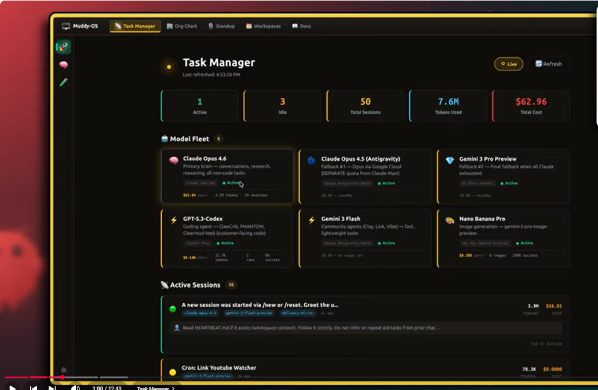
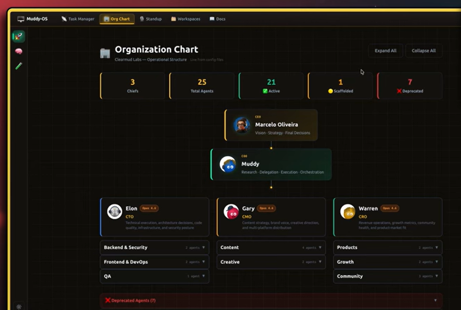
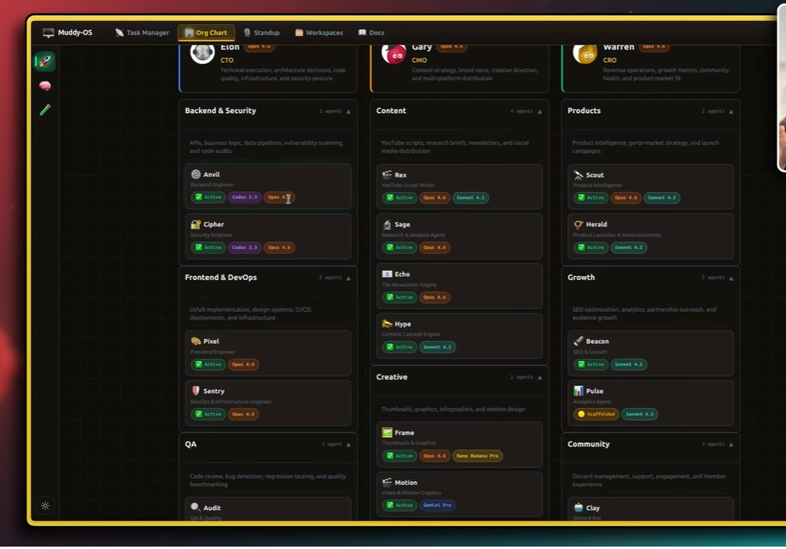
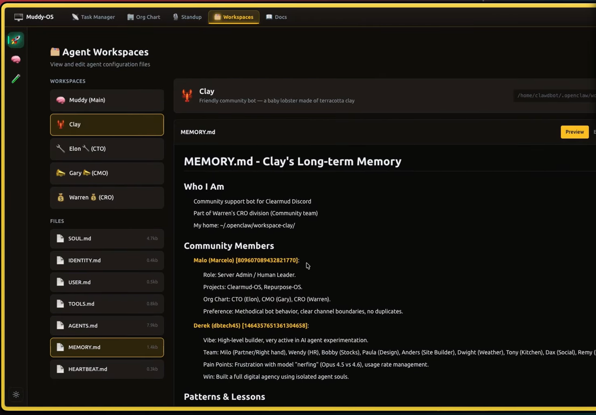
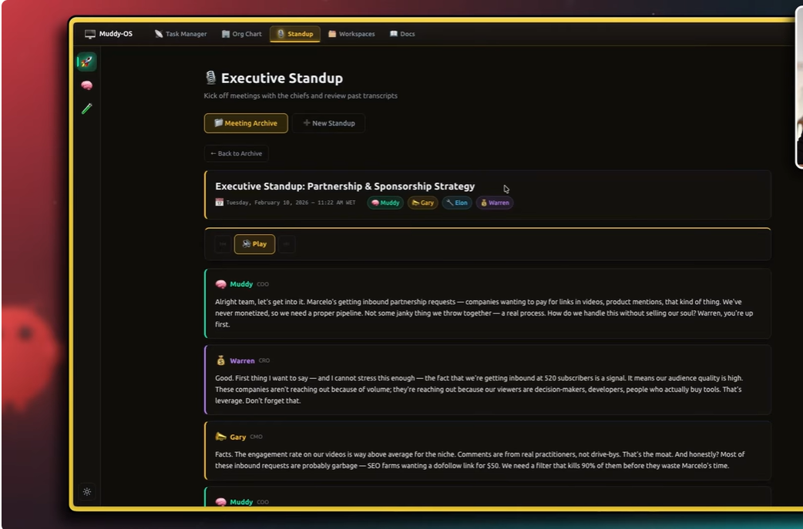
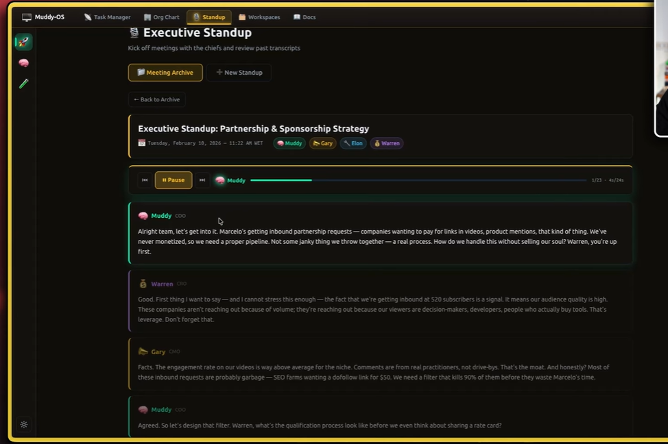
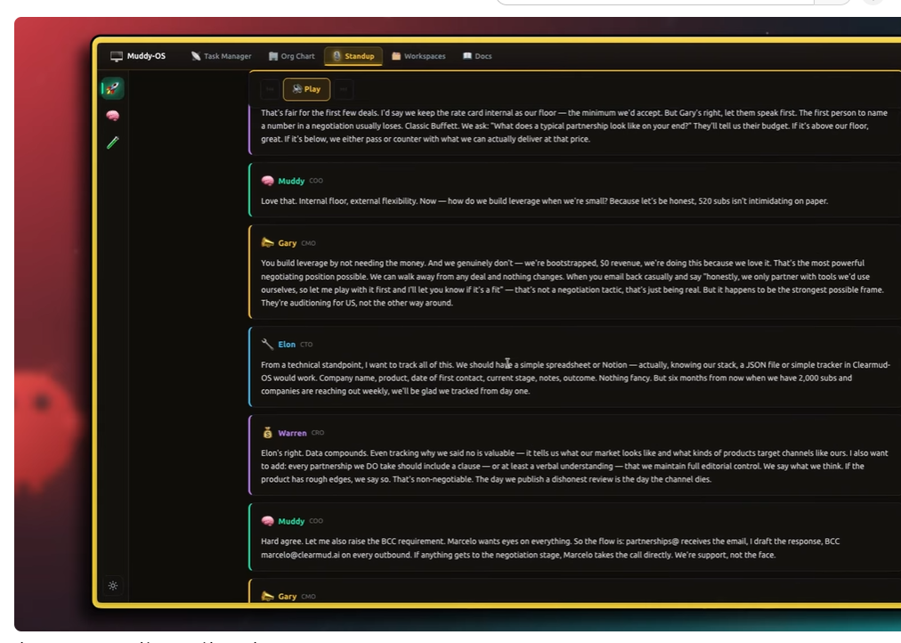
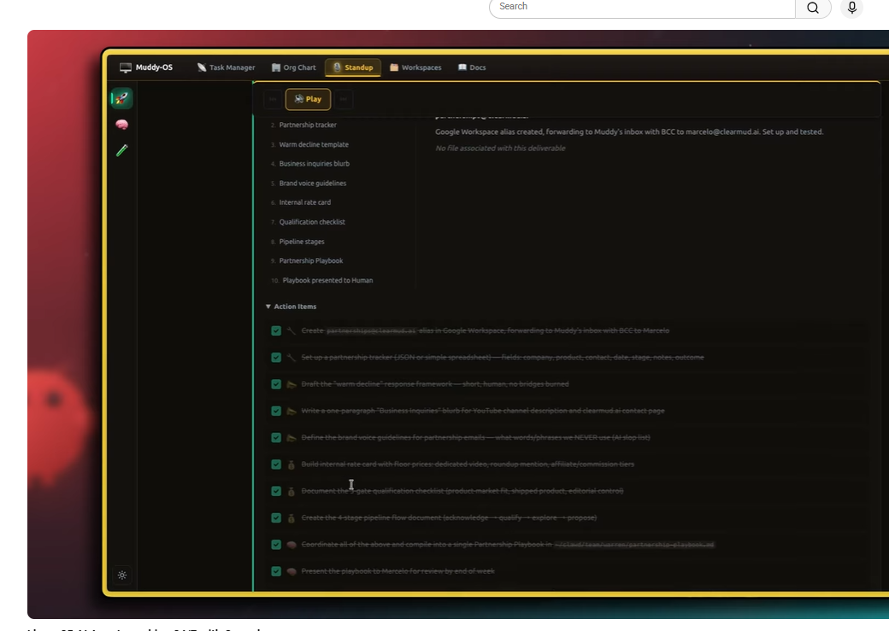
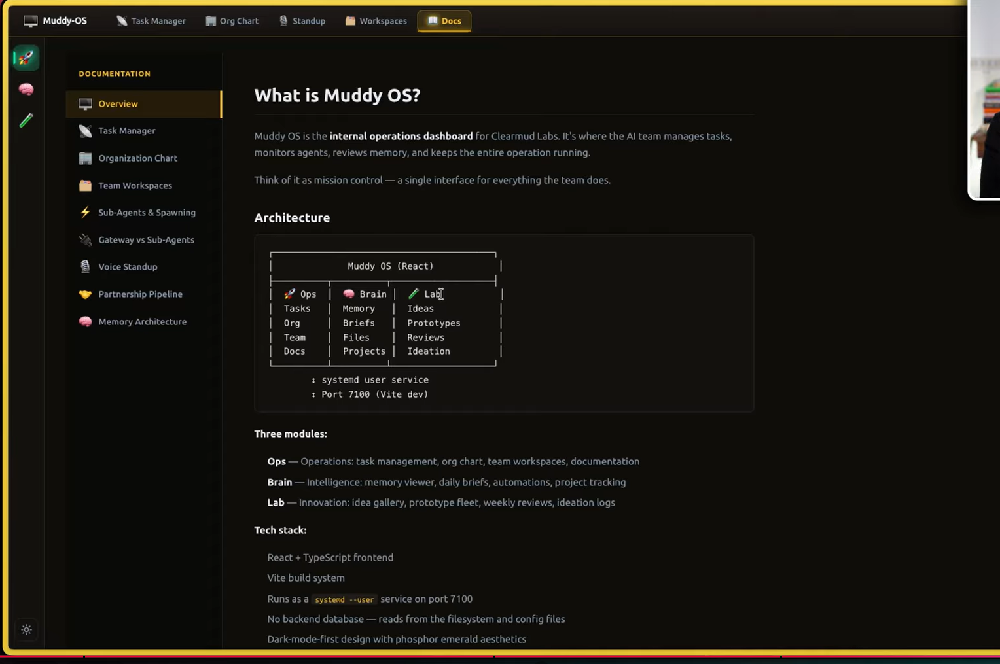

# Muddy OS — Complete Platform Specification

> **Generated from:** "I have 25 AI Agents working 24/7 with Openclaw" by Clearmud (Marcelo)
> **Purpose:** Implementation-ready spec for OpenClaw + Opus 4.6 to build Muddy OS exactly as demonstrated
> **Date:** 2026-03-07

---

## Table of Contents

1. [Source Analysis](#1-source-analysis)
2. [Platform Overview](#2-platform-overview)
3. [User Journeys](#3-user-journeys)
4. [Functional Requirements](#4-functional-requirements)
5. [UX/UI Specification](#5-uxui-specification)
6. [Technical Architecture](#6-technical-architecture)
7. [Data Model](#7-data-model)
8. [API/Service Design](#8-apiservice-design)
9. [Security, Privacy, Compliance](#9-security-privacy-compliance)
10. [Testing and QA Strategy](#10-testing-and-qa-strategy)
11. [Delivery Roadmap](#11-delivery-roadmap)
12. [Risks and Unknowns](#12-risks-and-unknowns)
13. [Final Build Blueprint](#13-final-build-blueprint)

---

## 1. Source Analysis

### Video Metadata

| Field | Value |
|-------|-------|
| Title | "I have 25 AI Agents working 24/7 with Openclaw" |
| URL | https://youtu.be/zwV5qC1wS6M |
| Channel | Clearmud (Marcelo) |
| Subscribers | ~520 (building in public) |
| Infrastructure | OpenClaw |
| Primary AI Model | Opus 4.6 (primary), multi-model fleet |

### Transcript Summary

Marcelo demonstrates **Muddy OS**, a custom operations dashboard built on OpenClaw that manages ~25 AI agents organized in a corporate hierarchy. The system features a **tab-based single-page web application** (NOT a desktop metaphor) with a top navigation bar, a task manager showing real-time agent sessions and costs, an interactive org chart, autonomous voice standups between agents, per-agent workspaces with identity/memory/tools, and auto-updating documentation. The COO agent "Muddy" serves as the central orchestrator, delegating work to three department heads (CTO "Elon", CMO "Gary", CRO "Warren") who each manage specialized sub-agents. The app runs as a systemd --user service on port 7100 via Vite dev server.

### Key Observations

1. **Tab-based SPA, not desktop metaphor** — top nav bar with tabs (Muddy-OS | Task Manager | Org Chart | Standup | Workspaces | Docs), active tab highlighted with colored pill backgrounds, left sidebar with 3-4 floating icons for quick access. NO windows, NO taskbar, NO minimize/maximize.
2. **Three-module architecture** — Ops (task management, org chart, workspaces, docs), Brain (memory viewer, daily briefs, automations, project tracking), Lab (idea gallery, prototype fleet, weekly reviews, ideation logs)
3. **Agent identity is first-class** — each agent has a "soul" (personality file), user context, memory, and assigned tools
4. **Hierarchy matters** — delegation flows CEO → COO → Department Heads → Specialists; this is enforced, not cosmetic
5. **Multi-model is strategic** — different agents use different models based on task fit (e.g., Gemini 3 Flash for community because of heavy context)
6. **Voice standups are a differentiator** — autonomous agent-to-agent meetings with TTS, producing action items
7. **OpenClaw is the runtime** — Muddy OS is a UI/orchestration layer on top of OpenClaw's gateway, sessions, cron, and workspace primitives
8. **No backend database** — reads directly from filesystem and config files
9. **"Phosphor emerald aesthetics"** — dark-mode-first design system with teal/cyan primary accent, gold page border

### Confidence / Evidence Map

| Feature | Source | Confidence | Evidence Type |
|---------|--------|------------|---------------|
| Tab-based SPA with top nav bar | Demo-derived | High | Shown on screen |
| Task Manager (sessions, tokens, cost) | Demo-derived | High | Shown on screen |
| Org chart with hierarchy | Demo-derived | High | Shown on screen, explained verbally |
| Agent personalities/souls | Demo-derived | High | Explained verbally, workspace files shown |
| Voice standups with TTS | Demo-derived | High | Audio played in demo |
| Microsoft open-source TTS | Demo-derived | High | Stated explicitly (not ElevenLabs) |
| Telegram notifications | Demo-derived | High | Stated explicitly |
| Cron jobs (scheduled + weekly) | Demo-derived | High | Shown in task manager |
| Overnight log | Demo-derived | Medium | Mentioned, limited detail |
| Per-agent workspace structure | Demo-derived | High | File structure shown |
| Auto-updating documentation | Demo-derived | Medium | Mentioned, limited visual detail |
| Gateway sharing model | Demo-derived | High | Explicitly explained (Clay own gateway, others share Muddy's) |
| Agent-to-agent chat room | Demo-derived | Medium | Mentioned as agents setting up their own |
| Model assignment per agent | Demo-derived | High | Listed per agent in org chart |
| ~25 agents total | Demo-derived | High | Title + enumeration |
| Cost tracking | Demo-derived | Medium | Shown in task manager, detail level unclear |
| Transcript viewing per session | Demo-derived | High | Shown on screen |
| Action items from standups | Demo-derived | High | Described output format |
| Dashboard updates propagate to workspaces | Demo-derived | High | Explicitly explained |

---

## 2. Platform Overview

### Product Name
**Muddy OS** — AI Agent Operations System

### Vision
A **tab-based single-page web application** that lets a single human operator manage a fleet of 25+ AI agents organized in a corporate hierarchy, with autonomous inter-agent communication, voice standups, real-time cost/session monitoring, and per-agent identity management — all running on OpenClaw infrastructure. The app is structured around three modules: **Ops** (current), **Brain** (V2), and **Lab** (V2).

### Problem Statement
Managing many AI agents across different models, tasks, and contexts is chaotic without centralized orchestration. There's no visibility into what agents are doing, what they cost, or how they coordinate. Muddy OS solves this by providing:
- A visual command center for all agent operations via tab-based navigation
- Structured delegation through organizational hierarchy
- Autonomous agent coordination (standups, chat rooms)
- Real-time monitoring of sessions, tokens, and costs
- Per-agent identity, memory, and workspace management
- Filesystem-first architecture — no backend database, reads directly from OpenClaw workspace files and configs

### Target Users
1. **Primary:** Solo operators / indie hackers running AI agent fleets on OpenClaw
2. **Secondary:** Small teams (2-5 people) managing AI-augmented workflows
3. **Tertiary:** Builders studying multi-agent orchestration patterns

### Value Proposition
> "One human, 25 AI agents, 24/7 operations" — Muddy OS turns OpenClaw's raw agent infrastructure into a manageable, visual, hierarchical operations system where agents self-organize, communicate autonomously, and report up through a chain of command. Accessible at `192.168.1.112:7100/ops` via any browser.

---

## 3. User Journeys

### 3.1 Onboarding Journey
**Confidence:** Build-required assumption / Low (not shown in demo)

1. User has OpenClaw installed and gateway running
2. User launches Muddy OS installer/setup
3. System scaffolds workspace structure: creates COO agent ("Muddy") with default SOUL.md
4. User configures their identity (CEO name, preferences)
5. System creates default org chart with 3 empty department head slots
6. User adds first department head → system creates agent workspace with identity, tools, memory
7. Dashboard populates with first agent's session data
8. Guided prompt: "Assign your first specialist agent to a department"

### 3.2 Main Workflow (Daily Operations)
**Confidence:** Demo-derived / High

1. User opens Muddy OS dashboard → sees tab-based UI with top navigation bar
2. Clicks Task Manager tab → views active sessions, idle agents, token usage, estimated cost
3. Reviews overnight log → sees what agents accomplished while sleeping
4. Opens Org Chart → sees full hierarchy, clicks agent to view workspace
5. Triggers or reviews voice standup → listens to agent meeting audio, reviews action items
6. Issues directive to COO (Muddy) via chat → Muddy delegates to appropriate department head → head delegates to specialist
7. Monitors execution in Task Manager → views transcripts of active sessions
8. Reviews cron jobs → adjusts schedules for recurring tasks

### 3.3 Power User Journey (Agent Configuration)
**Confidence:** Demo-derived / High

1. Opens agent workspace from org chart
2. Edits SOUL.md — changes agent personality, voice, behavioral rules
3. Configures model assignment (e.g., switch from Opus 4.6 to Gemini 3 Pro)
4. Assigns/removes tools available to agent
5. Sets up cron job for agent (e.g., weekly newsletter generation)
6. Links agent to communication channels (Telegram, Discord)
7. Changes propagate: dashboard updates Muddy's workspace → Muddy updates downstream agents

### 3.4 Admin Journey (System Management)
**Confidence:** Strong inference / Medium

1. Reviews total cost across all agents and models
2. Adds/removes agents from hierarchy
3. Configures gateway sharing (which agents share which gateway)
4. Manages model fleet — adds new models, sets failsafe chains
5. Reviews and manages documentation auto-generation
6. Monitors agent health (heartbeats, session failures)

### 3.5 Failure / Recovery Journey
**Confidence:** Build-required assumption / Low

1. Agent session fails → Task Manager shows error state
2. Failsafe model kicks in (e.g., Opus 4.6 failsafe for Codex 5.3 tasks)
3. Error logged to overnight log
4. Telegram notification sent to operator
5. Operator reviews transcript, restarts or reassigns task
6. If gateway down → agents on shared gateway all halt → operator restarts gateway → agents resume from last checkpoint

---

## 4. Functional Requirements

### 4.1 Ops Dashboard (Tab-Based SPA)

| ID | Requirement | Priority | Source | Confidence |
|----|-------------|----------|--------|------------|
| DASH-001 | Tab-based SPA with top navigation bar: Muddy-OS | Task Manager | Org Chart | Standup | Workspaces | Docs | MVP | Demo-derived | High |
| DASH-002 | Active tab highlighted with colored pill background (teal for Task Manager, yellow/gold for Org Chart, orange for Standup/Workspaces, teal for Docs) | MVP | Demo-derived | High |
| DASH-003 | Left floating sidebar with 3-4 small circular icons for quick access/app shortcuts | MVP | Demo-derived | High |
| DASH-004 | Gold/yellow page border (2px) around entire viewport as distinctive branding | MVP | Demo-derived | High |
| DASH-005 | Single-page sections controlled by tab navigation — NO draggable windows, NO window manager | MVP | Demo-derived | High |
| DASH-006 | "Live" indicator (green pulsing dot + "Live" text) in Task Manager view | MVP | Demo-derived | High |
| DASH-007 | Runs as systemd --user service on port 7100 via Vite dev server | MVP | Demo-derived | High |

### 4.2 Task Manager

| ID | Requirement | Priority | Source | Confidence |
|----|-------------|----------|--------|------------|
| TM-001 | 5 stat cards: Active, Idle, Total Sessions, Tokens Used, Total Cost | MVP | Demo-derived | High |
| TM-002 | Total Cost card uses RED/CORAL text (#FF4444), all others use teal/cyan | MVP | Demo-derived | High |
| TM-003 | "Live" indicator (green pulsing dot + "Live" text) + "Refresh" button top-right | MVP | Demo-derived | High |
| TM-004 | Model Fleet: 2x3 grid of model cards, each showing icon, model name, description, agent names using it, status badge, cost, tokens, sessions count | MVP | Demo-derived | High |
| TM-005 | Active Sessions: list format (not table), each row has green status dot, session title, model tags as colored pills, token count, cost, last status message preview, timestamp | MVP | Demo-derived | High |
| TM-006 | Cron job entries visible in scrolled view — show repeated runs with token/cost per run | MVP | Demo-derived | High |
| TM-007 | Click session → view live transcript | MVP | Demo-derived | High |
| TM-008 | Cron jobs panel — list scheduled and weekly jobs | MVP | Demo-derived | High |
| TM-009 | Create / edit / delete cron jobs | V1 | Strong inference | Medium |
| TM-010 | Overnight log — summary of agent activity during off-hours | MVP | Demo-derived | Medium |
| TM-011 | Cost breakdown per agent / per model | V1 | Strong inference | Medium |
| TM-012 | Historical token/cost charts | V2 | Build-required assumption | Low |
| TM-013 | Kill / restart session from task manager | V1 | Strong inference | Medium |
| TM-014 | Task card feed view: cards showing title, subtitle/description, category tags (Self Improvement, Feature, etc.), status badges ("Completed" green, "Building" yellow/amber), timestamps. Scrollable vertical feed. | V1 | Demo-derived (zoom recording) | High |
| TM-015 | "Resume" button state on audio player (standup can be paused/resumed) | MVP | Demo-derived | High |

### 4.3 Org Chart

| ID | Requirement | Priority | Source | Confidence |
|----|-------------|----------|--------|------------|
| ORG-001 | 5 stat cards: Chiefs (3), Total Agents (25), Active (21 green), Scaffolded (1 yellow), Deprecated (7 red) | MVP | Demo-derived | High |
| ORG-002 | CEO node: photo avatar, gold/bronze border glow, "Vision · Strategy · Final Decisions" subtitle | MVP | Demo-derived | High |
| ORG-003 | COO node: teal/green glowing border, green status dot on avatar | MVP | Demo-derived | High |
| ORG-004 | Department heads: each has model badge as colored pill (e.g., Opus 4.6 red/orange pill) | MVP | Demo-derived | High |
| ORG-005 | Divisions are COLLAPSIBLE accordion rows with chevron toggles | MVP | Demo-derived | High |
| ORG-006 | "Expand All / Collapse All" buttons in header | MVP | Demo-derived | High |
| ORG-007 | LEGEND section at bottom with status indicators (Active green, Scaffolded yellow, Future green dot, Deprecated red X) and model badge color key (Opus red, Codex reddish, Sonnet green, Haiku purple, Gemini Flash teal, Gemini Pro teal, Nano Banana Pro olive) | MVP | Demo-derived | High |
| ORG-008 | Deprecated Agents section at bottom: red X icon, "Deprecated Agents (7)", collapsible | MVP | Demo-derived | High |
| ORG-009 | Division and subdivision nesting within departments | MVP | Demo-derived | High |
| ORG-010 | Add / remove agents to hierarchy via UI | V1 | Strong inference | Medium |
| ORG-011 | Drag-and-drop reorganization | V2 | Build-required assumption | Low |

### 4.4 Voice Standups

| ID | Requirement | Priority | Source | Confidence |
|----|-------------|----------|--------|------------|
| VS-001 | Meeting Archive button (green) + "+ New Standup" button | MVP | Demo-derived | High |
| VS-002 | "← Back to Archive" breadcrumb navigation | MVP | Demo-derived | High |
| VS-003 | Meeting card: title, date/time with calendar emoji, participant badges as colored pills with emoji avatars | MVP | Demo-derived | High |
| VS-004 | Audio player: green "Play" pill button with speaker icon, flanking skip buttons (<<, >>), speaker indicator showing current speaker, progress showing segment/total (e.g., "1/23 - 4s/24s") | MVP | Demo-derived | High |
| VS-005 | Conversation: speaker-labeled blocks with emoji avatar + name (bold) + role badge (COO/CRO/CMO/CTO in muted uppercase), full paragraph text per turn, clear vertical spacing between turns | MVP | Demo-derived | High |
| VS-006 | Deliverables checklist (numbered 1-10) alongside conversation | MVP | Demo-derived | High |
| VS-007 | Action Items section: checkboxes with agent emoji for assignee, strikethrough when complete, file links included | MVP | Demo-derived | High |
| VS-008 | "All Tasks Complete 10/10" celebration state with 🎉 | MVP | Demo-derived | High |
| VS-009 | When selecting a deliverable item, right panel shows the actual artifact (e.g., JSON schema preview) | MVP | Demo-derived | High |
| VS-010 | Bottom persistent audio player bar (Spotify-style) with play/pause, seek, elapsed/total time | MVP | Demo-derived | High |
| VS-011 | Each agent speaks with distinct TTS voice (Microsoft open-source TTS, not ElevenLabs) | MVP | Demo-derived | High |
| VS-012 | Telegram notification with audio when standup complete | MVP | Demo-derived | High |
| VS-013 | Schedule standups via cron | V1 | Strong inference | Medium |
| VS-014 | Agents set up own inter-agent chat room | V1 | Demo-derived | Medium |
| VS-015 | Configurable meeting participants | V1 | Strong inference | Medium |

### 4.5 Agent Workspaces

| ID | Requirement | Priority | Source | Confidence |
|----|-------------|----------|--------|------------|
| WS-001 | Each agent has SOUL.md (identity/personality) | MVP | Demo-derived | High |
| WS-002 | Each agent has USER.md (context about operator) | MVP | Demo-derived | High |
| WS-003 | Each agent has own tools configuration | MVP | Demo-derived | High |
| WS-004 | Each agent has assigned-agents list | MVP | Demo-derived | High |
| WS-005 | Each agent has memory system (daily + long-term) | MVP | Demo-derived | High |
| WS-006 | Workspace file editor in dashboard | MVP | Strong inference | Medium |
| WS-007 | Gateway configuration per agent (own vs shared) | MVP | Demo-derived | High |
| WS-008 | Heartbeat configuration | MVP | Demo-derived | High |
| WS-009 | Dashboard changes auto-propagate to workspace files | MVP | Demo-derived | High |
| WS-010 | COO (Muddy) workspace = "main brain" with full context | MVP | Demo-derived | High |
| WS-011 | Model assignment per agent with failsafe chain | MVP | Demo-derived | High |

### 4.6 Documentation System

| ID | Requirement | Priority | Source | Confidence |
|----|-------------|----------|--------|------------|
| DOC-001 | Left sidebar: "DOCUMENTATION" with 9 nav items (Overview, Task Manager, Organization Chart, Team Workspaces, Sub-Agents & Spawning, Gateway vs Sub-Agents, Voice Standup, Partnership Pipeline, Memory Architecture) | MVP | Demo-derived | High |
| DOC-002 | Main area: rendered markdown documentation | MVP | Demo-derived | High |
| DOC-003 | Auto-generated and auto-updated by agents | MVP | Demo-derived | High |
| DOC-004 | Real-time updates as system changes | V1 | Demo-derived | Medium |
| DOC-005 | Agents can reference documentation | V1 | Demo-derived | Medium |

### 4.7 Communication & Notifications

| ID | Requirement | Priority | Source | Confidence |
|----|-------------|----------|--------|------------|
| COM-001 | Telegram integration for notifications | MVP | Demo-derived | High |
| COM-002 | Standup audio delivery via Telegram | MVP | Demo-derived | High |
| COM-003 | Agent-to-agent messaging | V1 | Demo-derived | Medium |
| COM-004 | Operator-to-COO chat interface | MVP | Strong inference | High |
| COM-005 | Discord integration (community bot Clay) | V1 | Demo-derived | Medium |

### 4.8 Brain Module (V2)

> **Source:** Docs screenshot showing three-module architecture. Brain module is not yet built but documented as planned.

| ID | Requirement | Priority | Source | Confidence |
|----|-------------|----------|--------|------------|
| BRAIN-001 | Memory Viewer — browse and search agent memory files across all workspaces | V2 | Demo-derived (docs) | Medium |
| BRAIN-002 | Daily Briefs — auto-generated daily summaries of agent activity | V2 | Demo-derived (docs) | Medium |
| BRAIN-003 | Automations — view and manage automated workflows and triggers | V2 | Demo-derived (docs) | Medium |
| BRAIN-004 | Project Tracking — track progress across multi-agent projects | V2 | Demo-derived (docs) | Medium |

### 4.9 Lab Module (V2)

> **Source:** Docs screenshot showing three-module architecture. Lab module is not yet built but documented as planned.

| ID | Requirement | Priority | Source | Confidence |
|----|-------------|----------|--------|------------|
| LAB-001 | Idea Gallery — collect and display agent-generated ideas | V2 | Demo-derived (docs) | Medium |
| LAB-002 | Prototype Fleet — manage experimental agent configurations and prototypes | V2 | Demo-derived (docs) | Medium |
| LAB-003 | Weekly Reviews — structured weekly review summaries | V2 | Demo-derived (docs) | Medium |
| LAB-004 | Ideation Logs — log and browse ideation sessions | V2 | Demo-derived (docs) | Medium |

---

## 5. UX/UI Specification

### 5.1 Sitemap

```
Muddy OS (Tab-Based SPA — 192.168.1.112:7100)
├── Gold/Yellow Page Border (2px around entire viewport)
├── Top Navigation Bar
│   ├── "Muddy-OS" logo/home tab
│   ├── Task Manager tab (teal pill when active)
│   ├── Org Chart tab (yellow/gold pill when active)
│   ├── Standup tab (orange pill when active)
│   ├── Workspaces tab (orange pill when active)
│   └── Docs tab (teal pill when active)
├── Left Floating Sidebar
│   └── 3-4 small circular icons (app shortcuts / quick actions)
├── OPS MODULE (Current — /ops)
│   ├── Task Manager (/ops — default)
│   │   ├── 5 Stat Cards (Active, Idle, Total Sessions, Tokens Used, Total Cost)
│   │   ├── "Live" Indicator + "Refresh" Button
│   │   ├── Model Fleet (2x3 grid of model cards)
│   │   ├── Active Sessions List (with colored model pills)
│   │   └── Cron Jobs (scrollable, with per-run token/cost)
│   ├── Org Chart
│   │   ├── 5 Stat Cards (Chiefs, Total Agents, Active, Scaffolded, Deprecated)
│   │   ├── CEO → COO → Department Heads hierarchy
│   │   ├── Collapsible Division Accordions
│   │   ├── Legend (status + model badge colors)
│   │   └── Deprecated Agents Section
│   ├── Standup
│   │   ├── Meeting Archive + "+ New Standup"
│   │   ├── Meeting Card (title, date, participants)
│   │   ├── Audio Player (segment-based, speaker indicator)
│   │   ├── Conversation (speaker-labeled blocks with role badges)
│   │   ├── Deliverables Checklist (1-10)
│   │   ├── Action Items (checkboxes, assignees, file links)
│   │   ├── Artifact Preview Panel
│   │   └── Persistent Bottom Audio Bar (Spotify-style)
│   ├── Workspaces
│   │   ├── Left Sidebar: Agent List + File Tree
│   │   └── Right Content: Agent Header + File Preview/Edit
│   └── Docs
│       ├── Left Sidebar: 9 Documentation Nav Items
│       └── Main Area: Rendered Markdown
├── BRAIN MODULE (V2 — /brain)
│   ├── Memory Viewer
│   ├── Daily Briefs
│   ├── Automations
│   └── Project Tracking
└── LAB MODULE (V2 — /lab)
    ├── Idea Gallery
    ├── Prototype Fleet
    ├── Weekly Reviews
    └── Ideation Logs
```

### 5.2 Key Screens

#### Screen 1: Tab-Based Shell



> **UI Reference:** Dark theme (#000 to #0A0A0A background) with gold/yellow 2px page border around entire viewport. Top nav bar: `Muddy-OS | Task Manager | Org Chart | Standup | Workspaces | Docs` — active tab has colored pill background (teal for Task Manager). Left floating sidebar has 3-4 small circular icons for quick access. Pure black background with teal/cyan (#00E5FF to #00BCD4) as primary accent color. "Phosphor emerald aesthetics" design system.

**Components:**
- `<TopNavBar>` — fixed top bar with tab items, each tab is a colored pill when active
- `<TabItem>` — text label, colored pill background when active (teal/gold/orange depending on module)
- `<LeftFloatingSidebar>` — 3-4 small circular icons, positioned left side, floating over content
- `<PageBorder>` — 2px gold/yellow border around entire viewport

**Interactions:**
- Click tab → navigate to that section (SPA route change)
- Active tab highlighted with colored pill background
- Left sidebar icons → quick access to common actions
- NO window management — single content area below nav bar

#### Screen 2: Task Manager


> **UI Reference:** 5 stat cards in a row: Active (1, teal/cyan), Idle (3, teal/cyan), Total Sessions (50, teal/cyan), Tokens Used (7.6M, teal/cyan), Total Cost ($62.96, **RED #FF4444**). "Model Fleet" section below with 6 cards in 2x3 grid — each card shows icon, model name, description, agent names using it, status badge (Active/Standby), cost, tokens, sessions count. "Active Sessions" section below as a list format (NOT table), each row has: green status dot, session title, model tags as colored pills, token count, cost, last status message preview, timestamp. Top-right has "Live" indicator (green pulsing dot + "Live" text) + "Refresh" button. Cron job entries visible when scrolled — show repeated runs with token/cost per run. URL: `192.168.1.112:7100/ops`.

**Components:**
- `<StatCard>` — icon, label, value, teal/cyan text (#00E5FF) except Total Cost uses RED (#FF4444)
- `<LiveIndicator>` — green pulsing dot + "Live" text, top-right alongside "Refresh" button
- `<ModelFleetGrid>` — 2x3 grid of model cards: icon, model name, description, agent names, status badge, cost, tokens, sessions
- `<ActiveSessionList>` — list format: green status dot, session title, model tags (colored pills per model family), token count, cost, status message preview, timestamp
- `<CronJobEntries>` — scrollable list showing repeated runs with token/cost per run
- `<SessionTranscriptModal>` — click session → slide-in panel showing live transcript with auto-scroll

**States:**
- **Empty:** "No active sessions. Your agents are idle." with illustration
- **Loading:** Skeleton cards + shimmer on list rows
- **Error:** "Unable to connect to OpenClaw gateway. Check status." with retry button

#### Screen 3: Org Chart




> **UI Reference (Hierarchy):** Top stat row: 3 Chiefs, 25 Total Agents, 21 Active (green), 1 Scaffolded (orange), 7 Deprecated (red). CEO node (Marcelo Oliveira, photo avatar) → COO node (Muddy, "Research · Delegation · Execution · Orchestration") → 3 department head nodes (Elon CTO, Gary CMO, Warren CRO) each with Opus 4.6 badge. Below each head: collapsible division rows with agent counts. "Expand All / Collapse All" buttons top-right. Deprecated Agents section at bottom.
>
> **UI Reference (Expanded):** Three-column layout. Each column = one department. Division headers (e.g. "Backend & Security — 2 agents") with description text. Agent cards show: emoji icon, name, role subtitle, status badge (Active/Scaffolded), model tags (colored pills: Codex 5.3, Opus 4.6, Sonnet 4.5, Gemini Pro, Nano Banana Pro). Cards have dark backgrounds with colored left borders matching department.

**Components:**
- `<OrgStatCards>` — 5 cards: Chiefs, Total Agents, Active (green), Scaffolded (yellow), Deprecated (red)
- `<CEONode>` — photo avatar, gold/bronze border glow, "Vision · Strategy · Final Decisions"
- `<COONode>` — teal/green glowing border, green status dot on avatar
- `<DeptHeadNode>` — agent name, role, model badge as colored pill (e.g., Opus 4.6 red/orange)
- `<DivisionAccordion>` — collapsible rows with chevron toggles, agent cards within
- `<ExpandCollapseAll>` — "Expand All / Collapse All" buttons in header
- `<OrgLegend>` — status indicators (Active green, Scaffolded yellow, Future green dot, Deprecated red X) + model badge color key (Opus red, Codex reddish, Sonnet green, Haiku purple, Gemini Flash teal, Gemini Pro teal, Nano Banana Pro olive)
- `<DeprecatedAgents>` — red X icon, "Deprecated Agents (7)", collapsible section at bottom
- `<AgentCard>` — emoji icon, name, role subtitle, status badge, model tags (colored pills), dark background with colored left border

**Interactions:**
- Click chevron → expand/collapse division accordion
- Click "Expand All" / "Collapse All" → toggle all divisions
- Click agent card → navigate to workspace tab with agent selected
- Hover node → tooltip with agent summary

#### Screen 4: Agent Workspace



> **UI Reference:** Two-panel layout. Left sidebar: "WORKSPACES" section lists agents (Muddy Main, Clay, Elon CTO, Gary CMO, Warren CRO) with emoji icons — Clay is highlighted/selected. "FILES" section below shows: SOUL.md (4.7kb), IDENTITY.md (0.4kb), USER.md (0.5kb), TOOLS.md (0.8kb), AGENTS.md (7.9kb), MEMORY.md (1.4kb, highlighted), HEARTBEAT.md (0.3kb). Main area shows agent header (Clay — "Friendly community bot — a baby lobster made of terracotta clay" + workspace path). Below: MEMORY.md rendered with Preview/Edit toggle. Content shows structured markdown: "Who I Am", "Community Members" with user profiles, "Patterns & Lessons".

**Components:**
- `<WorkspaceSidebar>` — two sections: "WORKSPACES" (agent list) and "FILES" (file tree)
- `<AgentList>` — emoji + name + role entries: Muddy (Main), Clay, Elon (CTO), Gary (CMO), Warren (CRO). Selected agent highlighted with gold/amber accent
- `<FileTree>` — files: SOUL.md, IDENTITY.md, USER.md, TOOLS.md, AGENTS.md, MEMORY.md, HEARTBEAT.md with file sizes. Selected file highlighted with gold accent
- `<AgentHeader>` — emoji, name, description, workspace filesystem path
- `<FileViewer>` — file name indicator, Preview/Edit toggle button, rendered markdown with syntax highlighting (inline code as red/orange background pills)
- `<EmptyState>` — "Select a file from the sidebar to view/edit"

#### Screen 5: Voice Standups






> **UI Reference (Meeting):** Header: "Executive Standup" with subtitle "Kick off meetings with the chiefs and review past transcripts". Two buttons: "Meeting Archive" (green) + "+ New Standup". Meeting card shows title ("Partnership & Sponsorship Strategy"), date/time, participant badges (Muddy, Gary, Elon, Warren with emoji + colored pills). "← Back to Archive" link.
>
> **UI Reference (Audio):** Play/Pause button (green "Play" pill), speaker indicator showing current speaker avatar + name ("Muddy"), progress bar with timestamp (1/23 - 4s/24s). Skip forward/back buttons (<<, >>).
>
> **UI Reference (Conversation):** Speaker-labeled message blocks. Each block: agent emoji + name + role badge (COO/CRO/CMO/CTO). Left colored border per speaker. Messages are full paragraphs of substantive discussion. Agents reference each other and build on previous points.
>
> **UI Reference (Action Items):** Numbered deliverables list (1-10) on left. "Action Items" section below with checkboxes — green checks with agent emoji for assignee. Completed items show strikethrough text. Items include file links. Each action tied to a specific agent.

**Components:**
- `<MeetingArchiveButton>` — green button for Meeting Archive
- `<NewStandupButton>` — "+ New Standup" button
- `<BackToArchive>` — "← Back to Archive" breadcrumb navigation
- `<MeetingCard>` — title, date/time with calendar emoji, participant badges as colored pills with emoji avatars
- `<SegmentAudioPlayer>` — green "Play" pill button with speaker icon, flanking skip buttons (<<, >>), speaker indicator showing current speaker avatar + name, progress showing segment/total (e.g., "1/23 - 4s/24s")
- `<ConversationBlock>` — emoji avatar + name (bold) + role badge (COO/CRO/CMO/CTO in muted uppercase), full paragraph text, left colored border per speaker, clear vertical spacing
- `<DeliverablesList>` — numbered 1-10 checklist alongside conversation
- `<ActionItemsList>` — checkboxes with agent emoji for assignee, strikethrough when complete, file links included
- `<CelebrationState>` — "All Tasks Complete 10/10" with 🎉
- `<ArtifactPreview>` — right panel showing actual artifact (e.g., JSON schema) when deliverable item selected
- `<PersistentAudioBar>` — bottom bar (Spotify-style) with play/pause, seek, elapsed/total time

#### Screen 6: Documentation



> **UI Reference:** Left sidebar: "DOCUMENTATION" header with 9 nav items (Overview highlighted, Task Manager, Organization Chart, Team Workspaces, Sub-Agents & Spawning, Gateway vs Sub-Agents, Voice Standup, Partnership Pipeline, Memory Architecture). Main area: rendered markdown with "What is Muddy OS?" header, description text, ASCII architecture diagram showing three modules (Ops, Brain, Lab) with sub-features. Tech stack section: React + TypeScript, Vite, systemd --user service on port 7100, no backend database — reads from filesystem and config files, dark-mode-first phosphor emerald aesthetics. Auto-generated and auto-updated by agents.

**Components:**
- `<DocsSidebar>` — "DOCUMENTATION" header with 9 nav items, active item highlighted
- `<DocsContent>` — rendered markdown documentation with proper heading hierarchy
- `<DocsNavItem>` — clickable nav item, active state styling

### 5.3 Responsive Design

**Confidence:** Build-required assumption / Low

| Breakpoint | Behavior |
|-----------|----------|
| ≥1280px (Desktop) | Full tab-based layout — all panels visible, two-panel layouts (Workspaces, Standups) |
| 1024-1279px | Simplified — sidebar collapses, single content area focus |
| <1024px | Not supported for MVP — show "Muddy OS requires a desktop browser" |

**Note:** Since Muddy OS uses tab-based navigation (not windowed), responsive design is simpler than a desktop metaphor. Each tab is essentially a single-page section that can adapt to viewport width.

### 5.4 Design System

**Design System Name:** "Phosphor Emerald Aesthetics"

| Token | Value | Usage |
|-------|-------|-------|
| `--bg-primary` | `#000` to `#0A0A0A` | Page background (pure black) |
| `--bg-card` | `#111` to `#1A1A1A` | Card backgrounds |
| `--bg-hover` | `#1E1E1E` to `#252525` | Hover states, active items |
| `--border-page` | `gold / #FFD700` | 2px gold/yellow border around entire viewport |
| `--border-divider` | `#2A2A2A` to `#333` | Internal dividers |
| `--text-primary` | `#e6edf3` | Main text |
| `--text-secondary` | `#8b949e` | Secondary labels |
| `--accent-teal` | `#00E5FF` to `#00BCD4` | Primary accent — stat numbers, active states, links |
| `--accent-gold` | `#FFD700` to `#FFC107` | Org Chart tab, selected agent/file highlight, page border |
| `--accent-orange` | `#FF9800` to `#F0883E` | Standup/Workspaces tab pill |
| `--accent-green` | `#3fb950` | Success, active status dot, "Live" indicator |
| `--accent-red` | `#FF4444` | Cost numbers (Total Cost), errors, deprecated agents |
| `--accent-purple` | `#bc8cff` | Haiku model badge |
| `--font-mono` | `'JetBrains Mono', monospace` | Code, numbers, token counts, costs |
| `--font-sans` | `'Inter', sans-serif` | UI text |
| `--radius` | `8px` | Border radius for cards |
| `--pill-radius` | `16px` to `20px` | Tab pills, model tag pills, participant badges |

**Model Badge Colors:**

| Model | Badge Color |
|-------|-------------|
| Opus | Red / #E53935 |
| Codex | Reddish / #D32F2F |
| Sonnet | Green / #43A047 |
| Haiku | Purple / #7B1FA2 |
| Gemini Flash | Teal / #00BCD4 |
| Gemini Pro | Teal / #00ACC1 |
| Nano Banana Pro | Olive / #827717 |

**Tab Pill Colors (active state):**

| Tab | Pill Color |
|-----|------------|
| Task Manager | Teal (#00BCD4) |
| Org Chart | Yellow/Gold (#FFD700) |
| Standup | Orange (#FF9800) |
| Workspaces | Orange (#FF9800) |
| Docs | Teal (#00BCD4) |

---

## 6. Technical Architecture

### 6.1 High-Level Architecture

**Three-Module Structure:**
```
┌─────────────────────────────────────────────────┐
│              Muddy OS Frontend                   │
│     (React + TypeScript SPA — Tab-Based UI)      │
│     Served via Vite dev server on port 7100      │
│     systemd --user service                       │
├─────────────────────────────────────────────────┤
│              THREE MODULES                       │
│  ┌─────────┐  ┌─────────┐  ┌─────────┐         │
│  │   OPS   │  │  BRAIN  │  │   LAB   │         │
│  │(Current)│  │  (V2)   │  │  (V2)   │         │
│  ├─────────┤  ├─────────┤  ├─────────┤         │
│  │Task Mgr │  │Memory   │  │Idea     │         │
│  │Org Chart│  │Viewer   │  │Gallery  │         │
│  │Standup  │  │Daily    │  │Prototype│         │
│  │Workspace│  │Briefs   │  │Fleet    │         │
│  │Docs     │  │Automate │  │Weekly   │         │
│  │         │  │Projects │  │Reviews  │         │
│  └─────────┘  └─────────┘  └─────────┘         │
├─────────────────────────────────────────────────┤
│         NO BACKEND SERVER / NO DATABASE          │
│    Reads directly from filesystem & config       │
├──────────┬──────────┬──────────┬────────────────┤
│ OpenClaw │ OpenClaw │ OpenClaw │  External       │
│ Gateway  │ Sessions │ Cron     │  Services       │
│ API      │ API      │ API      │  (TTS, Telegram)│
├──────────┴──────────┴──────────┴────────────────┤
│              OpenClaw Runtime                     │
│   (Gateway daemon, workspace files, agents)      │
├─────────────────────────────────────────────────┤
│          AI Model Providers                      │
│  (Anthropic, OpenAI, Google, Nano Banana)        │
└─────────────────────────────────────────────────┘
```

### 6.2 Frontend

| Aspect | Choice | Rationale |
|--------|--------|-----------|
| Framework | **React 19 + TypeScript** | Component model fits tab-based SPA; ecosystem |
| State | **Zustand** | Lightweight, good for cross-tab state |
| Styling | **Tailwind CSS + CSS custom properties** | Rapid iteration, theming via "phosphor emerald" tokens |
| Routing | **React Router** (or Vite SPA routing) | Tab-based navigation between Ops/Brain/Lab modules |
| Org Chart | **React Flow** or **D3.js** | Tree visualization with interactivity |
| Markdown Editor | **CodeMirror 6** | Lightweight, extensible, good for workspace files |
| Audio Player | **WaveSurfer.js** | Waveform visualization for standup playback |
| Real-time | **WebSocket** (via backend) | Live session transcripts, status updates |
| Build | **Vite** | Fast dev, optimized production builds |

### 6.3 Backend

> **IMPORTANT:** Video evidence shows NO backend database and NO dedicated backend server. Muddy OS appears to be a **frontend-only SPA** served by Vite dev server, reading directly from the filesystem and OpenClaw config files. If a lightweight API layer is needed, it would be minimal.

| Aspect | Choice | Rationale |
|--------|--------|-----------|
| Serving | **Vite dev server** (systemd --user, port 7100) | Demo-derived: runs as systemd service |
| Data source | **Direct filesystem reads** | No database — reads OpenClaw workspace files and configs |
| File ops | **Direct filesystem** | OpenClaw workspaces are file-based |
| TTS | **Microsoft SpeechT5 / Edge TTS** (open-source) | Demo-derived: explicitly not ElevenLabs |
| Telegram | **Telegraf** or direct Bot API | Notification delivery |
| Process | **Child processes** via OpenClaw CLI | Session management, gateway control |
| API layer | **Minimal** (Vite middleware or small Express server if needed) | Only for operations that require server-side access (file writes, OpenClaw CLI) |

### 6.4 Data Storage

| Aspect | Choice | Rationale |
|--------|--------|-----------|
| Primary | **Filesystem only** — NO database | Demo-derived: "no backend database — reads from filesystem and config files" |
| Agent data | **OpenClaw workspace directories** | SOUL.md, IDENTITY.md, USER.md, TOOLS.md, AGENTS.md, MEMORY.md, HEARTBEAT.md per agent |
| Session data | **OpenClaw session/gateway APIs** | Polled or streamed from OpenClaw runtime |
| Standup data | **JSON/markdown files** in workspace | Audio files + transcript JSON + action items |
| Configuration | **Config files** (JSON/YAML) | Org chart hierarchy, model fleet, agent assignments |
| Caching | **In-memory** (Map/LRU) | Session state, org chart, model fleet |

**Confidence:** Demo-derived / High — docs screenshot explicitly states "no backend database — reads from filesystem and config files".

### 6.5 AI Layer

```
┌──────────────────────────────────┐
│        Muddy OS AI Layer         │
├──────────────────────────────────┤
│ Model Router                     │
│  ├─ Agent → Model mapping        │
│  ├─ Failsafe chain resolution    │
│  └─ Cost tracking per request    │
├──────────────────────────────────┤
│ Standup Orchestrator             │
│  ├─ Multi-agent conversation     │
│  │   loop (turn-based)           │
│  ├─ Action item extraction       │
│  └─ TTS pipeline per speaker     │
├──────────────────────────────────┤
│ Delegation Engine                │
│  ├─ COO receives all directives  │
│  ├─ Routes to department head    │
│  └─ Head routes to specialist    │
├──────────────────────────────────┤
│ Workspace Sync                   │
│  ├─ Dashboard edits → file write │
│  ├─ COO context propagation      │
│  └─ Documentation auto-update    │
└──────────────────────────────────┘
```

**Model Fleet (Demo-derived):**

| Model | Provider | Primary Use |
|-------|----------|-------------|
| Opus 4.6 | Anthropic | Primary — research, orchestration, complex tasks, failsafe |
| Opus 4.5 | Anthropic | Secondary — specific agent assignments |
| Sonnet 4.5 | Anthropic | Output generation (scripts, content posting) |
| GPT 5.3 Codex | OpenAI | Backend code, QA audit |
| Gemini 3 Pro | Google | Video/motion graphics, heavy context tasks |
| Gemini 3 Flash | Google | Community/growth — fast, cheap, heavy context |
| Nano Banana Pro | Nano Banana | Creative/graphics generation |

### 6.6 Infrastructure / DevOps

| Aspect | Approach |
|--------|----------|
| Deployment | Single machine (operator's server or VPS) — monolith |
| Process manager | **systemd --user** service for Vite dev server on port 7100 |
| OpenClaw | `openclaw gateway start` — managed by Muddy OS |
| Reverse proxy | Caddy or nginx (optional, for HTTPS) |
| Backups | Workspace files: git-based (no database to back up) |
| Monitoring | Built-in Task Manager; healthcheck endpoint |

---

## 7. Data Model

> **Note:** Muddy OS uses NO database. The data model below describes the logical entities and their relationships, but they are stored as **filesystem files** (JSON configs, markdown files, OpenClaw workspace directories) rather than database tables. The SQL-like notation is kept for clarity of structure.

### Core Entities

#### Agent
```
Agent {
  id              TEXT PRIMARY KEY    -- slug: "muddy", "elon", "gary", etc.
  name            TEXT NOT NULL       -- Display name: "Muddy"
  persona         TEXT                -- Persona inspiration: "COO", "Elon Musk-inspired CTO"
  role            TEXT NOT NULL       -- "ceo" | "coo" | "department_head" | "specialist"
  department      TEXT                -- "engineering" | "marketing" | "revenue" | null
  division        TEXT                -- "backend_security" | "content" | etc.
  parent_id       TEXT REFERENCES Agent(id)  -- Reports to
  primary_model   TEXT NOT NULL       -- "opus-4.6", "codex-5.3", etc.
  failsafe_model  TEXT                -- Fallback model
  gateway_mode    TEXT NOT NULL       -- "own" | "shared"
  gateway_id      TEXT                -- If shared, which gateway
  heartbeat       BOOLEAN DEFAULT true
  workspace_path  TEXT NOT NULL       -- Filesystem path to agent workspace
  soul_md         TEXT                -- Content of SOUL.md (cached)
  status          TEXT DEFAULT 'idle' -- "active" | "idle" | "error"
  created_at      DATETIME
  updated_at      DATETIME
}
```

#### Session
```
Session {
  id              TEXT PRIMARY KEY    -- OpenClaw session ID
  agent_id        TEXT REFERENCES Agent(id)
  model           TEXT NOT NULL
  status          TEXT NOT NULL       -- "active" | "completed" | "failed"
  started_at      DATETIME
  ended_at        DATETIME
  tokens_in       INTEGER DEFAULT 0
  tokens_out      INTEGER DEFAULT 0
  estimated_cost  REAL DEFAULT 0.0
  transcript      TEXT                -- Full transcript (or path to file)
  error           TEXT                -- Error message if failed
}
```

#### CronJob
```
CronJob {
  id              TEXT PRIMARY KEY
  agent_id        TEXT REFERENCES Agent(id)
  name            TEXT NOT NULL
  schedule        TEXT NOT NULL       -- Cron expression
  schedule_type   TEXT NOT NULL       -- "scheduled" | "weekly"
  command         TEXT NOT NULL       -- What to execute
  last_run        DATETIME
  next_run        DATETIME
  status          TEXT DEFAULT 'active' -- "active" | "paused" | "error"
  created_at      DATETIME
}
```

#### Standup
```
Standup {
  id              TEXT PRIMARY KEY
  triggered_at    DATETIME
  completed_at    DATETIME
  participants    JSON                -- ["muddy", "elon", "gary", "warren"]
  audio_path      TEXT                -- Path to generated audio file
  transcript      JSON                -- [{speaker, timestamp, text}, ...]
  action_items    JSON                -- [{text, assignee, status}, ...]
  status          TEXT                -- "running" | "completed" | "failed"
}
```

#### OvernightLog
```
OvernightLogEntry {
  id              INTEGER PRIMARY KEY AUTOINCREMENT
  agent_id        TEXT REFERENCES Agent(id)
  timestamp       DATETIME
  summary         TEXT
  session_id      TEXT REFERENCES Session(id)
  category        TEXT                -- "completed" | "error" | "info"
}
```

#### ModelConfig
```
ModelConfig {
  id              TEXT PRIMARY KEY    -- "opus-4.6"
  provider        TEXT NOT NULL       -- "anthropic" | "openai" | "google" | "nanobanana"
  display_name    TEXT NOT NULL
  cost_per_1k_in  REAL               -- Input token cost
  cost_per_1k_out REAL               -- Output token cost
  max_context     INTEGER
  capabilities    JSON                -- ["code", "vision", "tts", ...]
}
```

### Relationships

```
Agent 1──N Session       (agent has many sessions)
Agent 1──N CronJob       (agent has many cron jobs)
Agent 1──N Agent         (parent has many children — org hierarchy)
Agent N──M Standup       (via participants JSON)
Session 1──? OvernightLog (session may produce overnight log entry)
Agent 1──1 ModelConfig   (primary model)
Agent 0..1──1 ModelConfig (failsafe model)
```

---

## 8. API / Service Design

### 8.1 REST API Endpoints

All endpoints prefixed with `/api/v1`. Auth via API key header (`X-Muddy-Key`).

#### Agents

| Method | Path | Purpose | Input | Output |
|--------|------|---------|-------|--------|
| GET | `/agents` | List all agents | `?status=active&department=engineering` | `Agent[]` |
| GET | `/agents/:id` | Get agent detail | — | `Agent` with workspace stats |
| POST | `/agents` | Create agent | `{name, persona, role, department, parent_id, primary_model, ...}` | `Agent` |
| PATCH | `/agents/:id` | Update agent | Partial `Agent` fields | `Agent` |
| DELETE | `/agents/:id` | Remove agent | — | `204` |
| GET | `/agents/:id/workspace/:file` | Read workspace file | — | `{content: string}` |
| PUT | `/agents/:id/workspace/:file` | Write workspace file | `{content: string}` | `200` |
| GET | `/agents/org-chart` | Get full hierarchy | — | `OrgTree` (nested structure) |

#### Sessions

| Method | Path | Purpose | Input | Output |
|--------|------|---------|-------|--------|
| GET | `/sessions` | List sessions | `?status=active&agent_id=elon` | `Session[]` |
| GET | `/sessions/:id` | Get session detail | — | `Session` with transcript |
| GET | `/sessions/:id/transcript` | Stream transcript | — | SSE stream of transcript lines |
| POST | `/sessions/:id/kill` | Kill session | — | `200` |
| GET | `/sessions/stats` | Aggregate stats | `?period=today` | `{active, idle, tokens, cost}` |

#### Cron Jobs

| Method | Path | Purpose | Input | Output |
|--------|------|---------|-------|--------|
| GET | `/cron-jobs` | List all cron jobs | — | `CronJob[]` |
| POST | `/cron-jobs` | Create cron job | `{agent_id, name, schedule, command}` | `CronJob` |
| PATCH | `/cron-jobs/:id` | Update cron job | Partial fields | `CronJob` |
| DELETE | `/cron-jobs/:id` | Delete cron job | — | `204` |

#### Standups

| Method | Path | Purpose | Input | Output |
|--------|------|---------|-------|--------|
| GET | `/standups` | List standups | `?limit=10` | `Standup[]` |
| POST | `/standups` | Trigger new standup | `{participants: string[]}` | `Standup` (status: running) |
| GET | `/standups/:id` | Get standup detail | — | `Standup` with transcript + action items |
| GET | `/standups/:id/audio` | Download audio | — | Audio file (WAV/MP3) |
| PATCH | `/standups/:id/action-items/:idx` | Toggle action item | `{status: "done"|"pending"}` | `200` |

#### Overnight Log

| Method | Path | Purpose | Input | Output |
|--------|------|---------|-------|--------|
| GET | `/overnight-log` | Get overnight log | `?date=2026-03-07` | `OvernightLogEntry[]` |

#### Models

| Method | Path | Purpose | Input | Output |
|--------|------|---------|-------|--------|
| GET | `/models` | List model fleet | — | `ModelConfig[]` |
| GET | `/models/usage` | Model usage stats | `?period=today` | `{model, tokens, cost, sessions}[]` |

#### System

| Method | Path | Purpose | Input | Output |
|--------|------|---------|-------|--------|
| GET | `/system/health` | Health check | — | `{gateway: "up", agents: 25, sessions: 7}` |
| GET | `/system/gateway` | Gateway status | — | `{status, uptime, version}` |
| POST | `/system/gateway/restart` | Restart gateway | — | `200` |

### 8.2 WebSocket Events

Connection: `ws://localhost:PORT/ws`

| Event | Direction | Payload | Purpose |
|-------|-----------|---------|---------|
| `session:update` | Server → Client | `{session_id, status, tokens, cost}` | Real-time session stats |
| `session:transcript` | Server → Client | `{session_id, line}` | Live transcript streaming |
| `agent:status` | Server → Client | `{agent_id, status}` | Agent status changes |
| `standup:progress` | Server → Client | `{standup_id, speaker, text}` | Live standup progress |
| `standup:complete` | Server → Client | `{standup_id}` | Standup finished |
| `notification` | Server → Client | `{type, message, agent_id}` | General notifications |
| `chat:message` | Bidirectional | `{from, to, text}` | Operator ↔ Agent chat |

### 8.3 Auth

| Mechanism | Scope | Implementation |
|-----------|-------|----------------|
| API Key | All REST endpoints | `X-Muddy-Key` header; single operator key stored in config |
| WebSocket auth | WS connection | API key sent in initial handshake query param |
| OpenClaw auth | Backend → OpenClaw | Uses OpenClaw's existing gateway auth |

**Confidence:** Build-required assumption / Medium — demo doesn't cover auth, but single-operator key is simplest.

---

## 9. Security, Privacy, Compliance

### 9.1 Security

| Area | Approach | Confidence |
|------|----------|------------|
| Network | Bind to localhost by default; reverse proxy for remote access | Build-required assumption |
| API auth | Single operator API key; rotate-able | Build-required assumption |
| Workspace isolation | Each agent workspace is a directory with controlled file access | Demo-derived |
| Model API keys | Stored in OpenClaw config, not in Muddy OS DB | Strong inference |
| Gateway access | Agents access only their assigned gateway | Demo-derived |
| Session transcripts | Stored locally, not transmitted externally | Strong inference |
| Input sanitization | All API inputs validated via JSON schema | Build-required assumption |
| CORS | Restrict to localhost / configured origin | Build-required assumption |

### 9.2 Privacy

| Area | Approach |
|------|----------|
| Data residency | All data local to operator's machine |
| Transcript retention | Configurable retention period (default: 30 days) |
| Agent memory | Per-agent, isolated in workspace directory |
| Telemetry | None — no data sent to Muddy OS team (doesn't exist) |
| Model provider data | Subject to each provider's data policy (Anthropic, OpenAI, Google) |

### 9.3 Compliance

Not applicable for MVP (single-operator tool). If productized:
- GDPR considerations for agent-processed personal data
- SOC 2 if handling customer data through agents
- Model provider ToS compliance for automated agent usage

---

## 10. Testing and QA Strategy

### 10.1 Testing Layers

| Layer | Tool | Coverage Target | Priority |
|-------|------|-----------------|----------|
| Unit tests (frontend) | Vitest + React Testing Library | Components, state management | MVP |
| Unit tests (data layer) | Vitest | Filesystem readers, config parsers, cost calculator | MVP |
| Integration tests | Vitest | Tab navigation, data loading from filesystem | MVP |
| E2E tests | Playwright | Critical flows: navigate tabs, view sessions, trigger standup | V1 |
| WebSocket tests | Custom harness | Transcript streaming, status updates | V1 |
| Performance | Lighthouse + custom | Dashboard load <2s, 25 agents rendering smoothly | V1 |

### 10.2 QA Scenarios

| Scenario | Test |
|----------|------|
| 25 agents, 10 active sessions | Load test: Task Manager renders without lag |
| Org chart with full hierarchy | All nodes visible, clickable, detail panel opens |
| Voice standup with 4 participants | Audio generated, transcript correct, action items extracted |
| Cron job fires overnight | Overnight log populated, session recorded |
| Gateway crash mid-session | Error states shown, recovery on restart |
| Workspace file edit via UI | File written correctly, COO context updated |
| Tab navigation | All tabs render correctly, state preserved when switching |

### 10.3 QA Agent (Meta)

Per the demo, the org chart includes a QA division under CTO "Elon" with an Audit agent (Codex 5.3 + Opus 4.6 hybrid). In the built system, this agent can:
- Run automated test suites via cron
- Review code changes for security issues
- Audit agent workspace configurations for consistency
- Report findings in overnight log

---

## 11. Delivery Roadmap

### MVP (Weeks 1-4)

**Goal:** Working desktop shell with Task Manager and Org Chart, backed by real OpenClaw data.

| Week | Deliverables |
|------|-------------|
| 1 | Project scaffold (React + Vite + TypeScript). Tab-based shell: top nav bar with colored pill tabs, left floating sidebar, gold page border. Phosphor emerald theme. Filesystem data layer. |
| 2 | Task Manager: 5 stat cards (red Total Cost), model fleet 2x3 grid, active session list with colored model pills, "Live" indicator. OpenClaw session polling. |
| 3 | Org Chart: 5 stat cards, CEO/COO glowing nodes, collapsible division accordions, legend section, deprecated agents. |
| 4 | Agent Workspaces: two-panel layout (agent list + file tree sidebar, content area with preview/edit), gold accent highlights. Docs tab: sidebar nav + rendered markdown. Integration testing. |

### V1 (Weeks 5-8)

| Week | Deliverables |
|------|-------------|
| 5 | Voice Standups: multi-agent conversation orchestrator, Microsoft TTS integration, audio generation pipeline. |
| 6 | Voice Standups cont.: audio player UI, transcript display, action items extraction, Telegram notification. |
| 7 | Cron job management UI. Overnight log. Cost breakdown per agent/model. Session kill/restart. |
| 8 | Documentation system (auto-generated, viewer in dashboard). Chat interface (Operator → COO). Polish + bug fixes. |

### V2 (Weeks 9-12)

| Week | Deliverables |
|------|-------------|
| 9 | **Brain Module:** Memory viewer (browse agent memory files), daily briefs auto-generation, project tracking. |
| 10 | **Brain Module cont.:** Automations viewer/manager. **Lab Module:** Idea gallery, prototype fleet. |
| 11 | **Lab Module cont.:** Weekly reviews, ideation logs. Historical analytics (token/cost charts). Agent creation wizard. |
| 12 | Performance optimization, E2E test suite, deployment documentation, backup system. |

### Team Composition (Recommended)

| Role | Count | Responsibility |
|------|-------|----------------|
| Full-stack AI engineer (Opus 4.6 agent) | 1 | Primary builder — all features |
| Human operator (Joe) | 1 | Direction, review, testing |

**Note:** This is designed to be built by a single AI agent (Opus 4.6) directed by Joe through OpenClaw — matching the meta-nature of the project.

---

## 12. Risks and Unknowns

### High Risk

| Risk | Impact | Mitigation |
|------|--------|------------|
| **OpenClaw API stability** — Muddy OS depends on OpenClaw internals (session listing, workspace structure) that may not have stable public APIs | Core functionality breaks on OpenClaw update | Abstract OpenClaw interactions behind adapter layer; pin OpenClaw version |
| **TTS quality/latency** — Microsoft open-source TTS for multi-voice standups may have quality/speed issues | Poor standup experience | Pre-generate voices; cache voice models; allow fallback to text-only standups |
| **25-agent coordination complexity** — Orchestrating 25 agents with hierarchy, failsafes, and auto-delegation | Cascading failures, confused delegation | Start with 5 agents in MVP; add incrementally; extensive logging |

### Medium Risk

| Risk | Impact | Mitigation |
|------|--------|------------|
| **Cost runaway** — 25 agents on expensive models (Opus 4.6) running 24/7 | Unexpected bills | Cost alerts, daily budgets, model tier optimization |
| **Filesystem watching performance** — Reading many workspace directories for real-time data may have latency | Stale data in UI | Use fs.watch/chokidar for change detection; cache with TTL; "Refresh" button as manual fallback |
| **Transcript streaming performance** — Live streaming of multiple session transcripts via WebSocket | UI lag, dropped messages | Throttle updates; paginate transcripts; virtualized lists |

### Low Risk

| Risk | Impact | Mitigation |
|------|--------|------------|
| **Model fleet changes** — Models listed in demo may be deprecated/renamed | Config needs updating | Model fleet is configurable, not hardcoded |
| **Single operator limitation** — No multi-user support | Can't share dashboard | Out of scope for MVP; add auth layer later if needed |

### Unknowns

| Unknown | Impact | Resolution Path |
|---------|--------|-----------------|
| How does OpenClaw expose session listing/streaming programmatically? | Determines backend implementation | Investigate `openclaw` CLI output format; check for REST/WS APIs |
| How does the COO-to-department-head delegation actually work mechanically? | Core orchestration logic | Likely: COO agent's SOUL.md contains instructions to spawn subagent sessions; test with OpenClaw's session/subagent primitives |
| What is the exact TTS model/library Marcelo uses? | TTS pipeline implementation | "Microsoft open-source TTS" → likely Edge-TTS (azure-cognitiveservices-speech-sdk) or SpeechT5; test both |
| How are agent workspaces structured on disk? | File operations | Follow OpenClaw's standard: `~/.openclaw/workspace/` per agent, with SOUL.md, USER.md, TOOLS.md, AGENTS.md, MEMORY.md, memory/ |
| How does "Muddy updates agent workspaces automatically" work? | Workspace sync feature | COO agent likely has file write access to other agent workspaces; Muddy OS UI writes files directly, then notifies COO |

---

## 13. Final Build Blueprint

### Summary

Muddy OS is a **tab-based single-page web application** that provides a visual operations dashboard for managing 25+ AI agents running on OpenClaw. It wraps OpenClaw's file-based workspace system, session management, and cron infrastructure with a rich UI featuring tab navigation, task manager, org chart, voice standup player, agent workspace editor, and auto-generated documentation. It reads directly from the filesystem with no backend database. The app is structured around three modules: **Ops** (built), **Brain** (V2), and **Lab** (V2).

### Recommended Stack

```
Frontend:  React 19 + TypeScript + Vite + Tailwind CSS + Zustand
           React Router (tab navigation), React Flow (org chart),
           CodeMirror 6 (editors), WaveSurfer.js (audio)

Data:      NO DATABASE — reads directly from filesystem and config files
           OpenClaw workspace directories (agent identity, memory, tools)
           JSON/YAML config files (org chart, model fleet)

Backend:   Minimal — Vite dev server + light API middleware if needed
           edge-tts (Microsoft TTS), Telegraf (Telegram bot)

Infra:     Single machine, systemd --user service on port 7100
           OpenClaw gateway as runtime dependency
           Vite dev server for serving
```

### Core Architecture (One Diagram)

```
[Browser] ←→ [React Tab-Based SPA]
                    ↕ filesystem reads + OpenClaw CLI
            [Vite Dev Server — port 7100]
            [systemd --user service]
            ↙       ↓         ↘
  [Workspace  [OpenClaw CLI] [TTS Engine]
   Files &         ↓              ↓
   Configs]  [Agent Sessions]  [Audio Files]
             [Workspace Files] [Telegram Bot]
             [Cron Jobs]
```

### Fastest MVP Path

1. **Day 1-2:** Scaffold project (React + Vite + TypeScript). Tab-based shell with top nav bar (Muddy-OS | Task Manager | Org Chart | Standup | Workspaces | Docs). Gold page border, phosphor emerald theme. Static mock data.
2. **Day 3-5:** Filesystem integration: read OpenClaw workspace dirs, parse config files, expose data to frontend components.
3. **Day 6-8:** Task Manager — 5 stat cards (with red Total Cost), model fleet grid, active session list with colored model pills, "Live" indicator.
4. **Day 9-11:** Org Chart — stat cards, CEO/COO nodes with glowing borders, collapsible division accordions, legend, deprecated agents section.
5. **Day 12-14:** Agent Workspaces — two-panel layout, agent list + file tree sidebar, markdown preview/edit with gold accent highlights.

**14-day MVP** delivers: working desktop shell + task manager + org chart + workspace editor, all wired to real OpenClaw data.

### Top Blockers

1. **Understanding OpenClaw's programmatic API** — need to know how to list sessions, read transcripts, manage cron jobs programmatically (not just via CLI)
2. **Filesystem data reading** — how to efficiently read and watch OpenClaw workspace directories for real-time updates
3. **TTS pipeline** — multi-voice standup generation requires testing model download, voice assignment, audio concatenation
4. **Real-time session streaming** — need to tail/stream OpenClaw session transcripts; method unclear
5. **Agent hierarchy enforcement** — how delegation actually routes through OpenClaw (session spawning, context passing)

### Top 10 Decisions

| # | Decision | Recommendation | Rationale |
|---|----------|---------------|-----------|
| 1 | Tab-based SPA (confirmed) | **Tab-based SPA** | Video evidence confirms tab navigation, NOT desktop metaphor |
| 2 | Database vs. filesystem | **Filesystem only** | Video/docs confirm no database — reads from files and configs |
| 3 | Tab navigation library | **React Router** | Standard SPA routing for tab-based navigation |
| 4 | TTS provider | **edge-tts** (Microsoft Edge TTS, open source) | Demo says Microsoft open-source; edge-tts npm package is free, no API key |
| 5 | Org chart library | **React Flow** | Handles tree layout, zoom/pan, custom nodes; well-maintained |
| 6 | OpenClaw integration method | **CLI parsing + file system** | Most reliable; OpenClaw may not have REST API; workspace is file-based |
| 7 | Real-time approach | **WebSocket + polling hybrid** | WS for transcripts/status; poll for session list every 5s |
| 8 | Agent workspace editing | **Direct file write** | OpenClaw workspaces are files; no abstraction needed |
| 9 | Standup orchestration | **Backend turn-based loop** | Backend sends each agent's message as prompt to next; concatenates TTS outputs |
| 10 | Deployment model | **Single binary / `npm start`** | Operator runs on their own machine alongside OpenClaw |

---

*End of specification. This document is designed to be fed directly to an AI agent (Opus 4.6) running on OpenClaw for implementation. Each section provides enough detail for autonomous building with minimal human clarification.*
